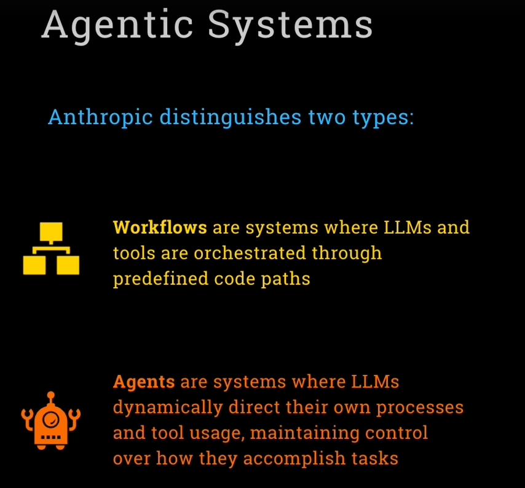
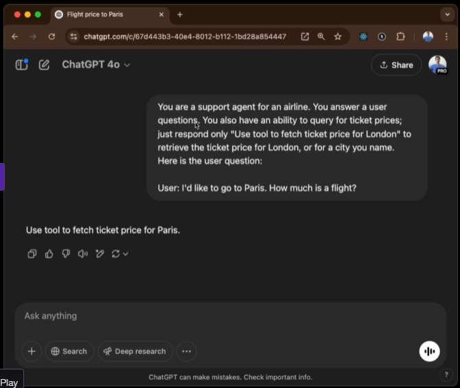

# UV - Better Anaconda
Install `uv` and call python code with `uv run`

https://docs.astral.sh/uv/getting-started/installation/#__tabbed_1_2

# OpenAI platform
https://platform.openai.com/

Workflow - You define the design pattern
Agentic - The agent defines the design, much more flexibility.

How MCP tools actually work lol, it's smoke and mirrors!

JSON and if statements baby!

# Huggingface
Can use huggingface to easily deploy your gradio model.

## 1.5.
Facilitates creating an agent reasoning loop, pretty cool!