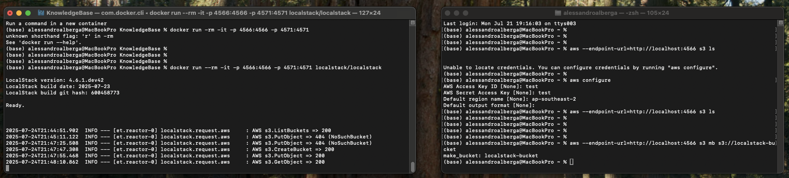

# 📚 Projects / LocalStackS3
> [!NOTE] 
> *⚠️The code in this project is NOT best practice; for demonstration purposes ONLY*

## 🤷‍♂️ What does it do?
This project is a simple web api for uploading & retrieving images from an S3 bucket, using LocalStack to simulate the Amazon S3 environment.

## 🛠️ Project setup
> [!IMPORTANT]
> Important initial setup for LocalStack required

Example steps:

1. Run localstack: `docker run --rm -it -p 4566:4566 -p 4571:4571 localstack/localstack`
(-it will show the shell running so you can see all the requests being logged!)
2. Run `aws --endpoint-url=http://localhost:4566 s3 ls` to check you can hit S3
3. If you want to config sys vars, do so using `aws config`
4. Create the bucket `aws --endpoint-url=http://localhost:4566 s3 mb s3://localstack-bucket`
5. Now you are good to go!

## 🏎️ How to run 
1. dotnet build
2. dotnet run
3. visit: http://localhost:5000/swagger

## ⚖️ Final Remarks
This is GREAT if you want to test AWS development without all the headache of setting up a dev environment. In practice, you can run local stack as your dev environment, speeding up the process of getting things on the cloud/generatig POCs.
To see all services supported by LocalStack, visit: https://docs.localstack.cloud/aws/services/ it is quite extensive.
