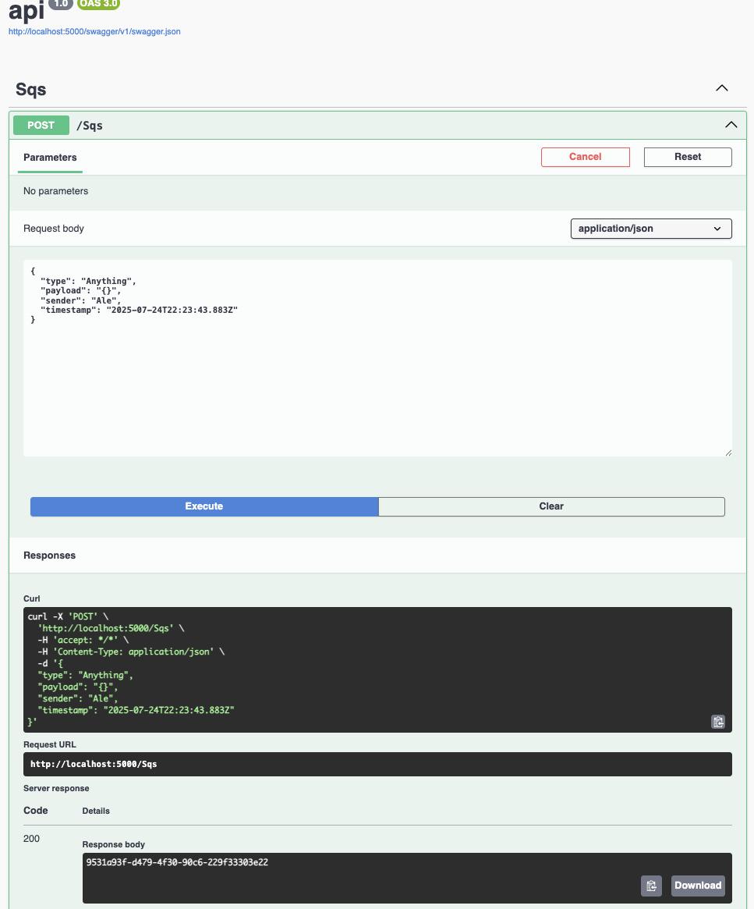
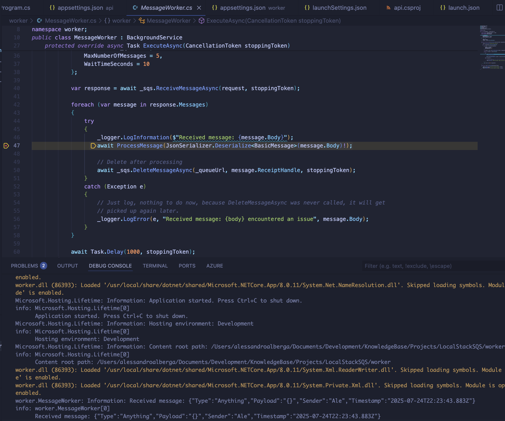

# 📦 Projects / BasicSQS
> [!WARNING]
> *The code in this project is NOT best practice; for demonstration purposes ONLY*

## 🤷‍♂️ What does it do?
A basic implementation of SQS. Leverages something called `LocalStack`. A really really super duper awesome tool that allows
you to emulate 60+ AWS services locally on your machine (including SQS!) and dev locally without mucking around setting up you AWS env, you can just learn how to use the services instead without worrying about the cloud for now!

## 🛠️ Project setup
> [!IMPORTANT]
> Download the AWS CLI if you do not already have it.

1. Run localstack: `docker run --rm -it -p 4566:4566 -p 4571:4571 localstack/localstack`
2. Create your queues (main + DLQ):
```
aws --endpoint-url=http://localhost:4566 sqs create-queue --queue-name basic-queue
aws --endpoint-url=http://localhost:4566 sqs create-queue --queue-name basic-dlq
```
3. get the dlq artificial arn:
```
aws --endpoint-url=http://localhost:4566 sqs get-queue-attributes \
  --queue-url http://localhost:4566/000000000000/basic-dlq \
  --attribute-name QueueArn
```
4. attach the DLQ to the main one:
```
aws --endpoint-url=http://localhost:4566 sqs set-queue-attributes \
  --queue-url http://localhost:4566/000000000000/basic-queue \
  --attributes '{"RedrivePolicy":"{\"deadLetterTargetArn\":\"arn:aws:sqs:ap-southeast-2:000000000000:basic-dlq\",\"maxReceiveCount\":\"3\"}"}'
```
5. Go to `http://localhost:5000/swagger` and start playing!

### What happens?
- If your worker receives a message and doesn't delete it, it becomes visible again.
- After 3 receives (as per maxReceiveCount), SQS automatically moves it to the DLQ.

## 🏎️ How to run
dotnet build
dotnet run

Run:


Success:



## ⚖️ Final Remarks
Amazing project demonstrating fast development without the need to set up the AWS enviornment itself.


## Usful Info
### 🔁 Life of a message (DLQ flow)
1. A message is sent to the main queue.
2. Your app receives it (via ReceiveMessage).
3. SQS hides it for VisibilityTimeout seconds (e.g. 30s).
4. Your app tries to process it.
5. If processing succeeds, you call DeleteMessage, and the message is gone forever ✅
6. If processing fails (exception, crash, timeout), and you do NOT call DeleteMessage, the message becomes visible again after the timeout ⏱️
7. This message is received again, and the ApproximateReceiveCount increases.
8. After maxReceiveCount (e.g. 3) is exceeded, SQS automatically moves the message to the DLQ

So you better be quick smart that your process takes less than the visibility timeout you set!
