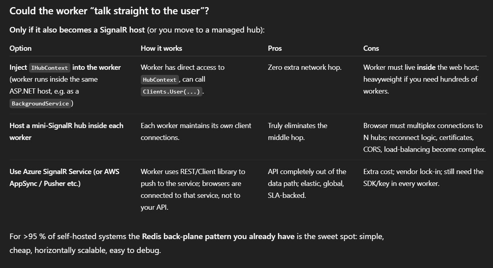

# 📨 Projects / SignalRMultiInstanceAndBackplane
> [!WARNING]
> *The code in this project is NOT best practice; for demonstration purposes ONLY*

Demonstrates a scalable solution with SignalR.

In this project we have multiple users (different tabs with a new instance of the client open), who can send messages to other specific users, connecting through the hub set up in the **api**.

But behind the scenes it is leveraging the redis stack exchange (for multiple instances of the server running in parrallel) 
and includes the backplane for use by a publisher.

The project demonstrates the following:
1. How to use SignalR
2. How to do auth with SignalR
3. How to run multiple concurrent instances of our hub
4. How to implement a backplane for sending messages from a producer to subscriber (the hub)
5. A worker server that channels messages through to the user via the api hub.

## Explanation
- Note that The worker never touches WebSockets; it only writes a tiny message into Redis and is instantly free to churn through the next job.
- The api web server is the only process that •knows* which TCP/WebSocket connection belongs to which user, so only it can deliver the packet to the browser. That “hop” is unavoidable unless you give your worker the exact same WebSocket responsibilities.
- Worker failure isolation: The worker can crash, restart, autoscale, or even be rewritten in Rust – it never holds application state about active users.

Explainer for why in this instance the middle "hop" is necessary?


### Api
Api web server containing our SignalR hub.

### Client
Hosts our browser react SPA.

### Worker
Worker background service for completing background tasks and writing to redis.

### 🔁 What is a SignalR backplane?
The backplane is a messaging layer that connects multiple instances of your app (e.g. when load-balanced across servers), allowing messages from one hub instance to reach clients connected to a different instance.

With a Redis backplane:
- Every SignalR message (e.g. Clients.All.SendAsync(...)) gets published to Redis.
- Redis fans out that message to every app instance subscribed to it.
- **Each instance checks which users are connected to it and delivers the message if relevant.**

## 🛠️ Project creation
api: `dotnet new web -n api`
client: `npm create vite@latest client -- --template react`
worker: `dotnet new worker -n worker`

## 🏎️ How to run 
### 🖥️ Client
```
cd client      
npm install    
npm run dev
```

### 🌐 Api
```
cd api
dotnet restore
dotnet build
dotnet run
```

### 👷 Worker
```
cd worker
dotnet restore
dotnet build
dotnet run
```
