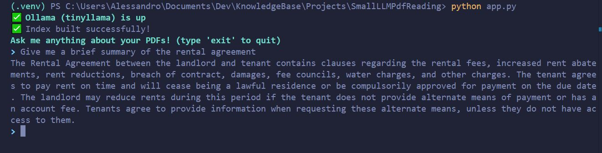

# 👾 Projects / SmallLLMPdfReading
> [!WARNING]
> *The code in this project is NOT best practice; for demonstration purposes ONLY*

> [!WARNING]
> *Running AI is processor intensive and optimal if you have a GPU enabled (Nvidia seems to be the only one that works)*

## 🤷‍♂️ What does it do?
This project reads a directory of pdfs that you have in `/docs` and one you start it you can ask questions about those documents! All the while without an internet connection (AI is local).



## 🛠️ Project setup
### Prerequisites
You are about to install some process and RAM heavy models locally, you need to first increase the cap for DOCKER and tell it it can use more ram via:
1. UPDATE file `C://Users/<Your username>/.wslconfig make the contents:
```
[wsl2]
memory=20GB           
processors=6         
swap=2GB         
```
I put 20GB but honestly put as much as you can spare.

2. `wsl --shutdown`
3. Quit docker completely
4. Reopen docker
-- And once you have ollama running you can verify with:
5. `docker exec -it ollama bash`
6. `free -h`

### Main setup
1. Start env: `python -m venv .venv`
2. Activate env: `.venv\Scripts\activate` (`source .venv\Scripts\activate` for mac)
3. Install requirements: `pip install -r requirements.txt`

### Run Ollama in Docker
1. run: `docker run -d --name ollama -p 11434:11434 -v ollama:/root/.ollama ollama/ollama`
2. exec into the container: `docker exec -it ollama bash`
3. pull required models like: 
```
ollama pull mistral #downloads 4.1GB file
ollama pull tinyllama #downloads 400MBfile
```

## 🏎️ How to run 
```
.venv\Scripts\activate
python app.py <your model>
```

## ⚖️ Final Remarks
This was soooo difficult to finally get working, the instructions should work but depending on your setup it may be a bit finicky. But it is really damn cool :)